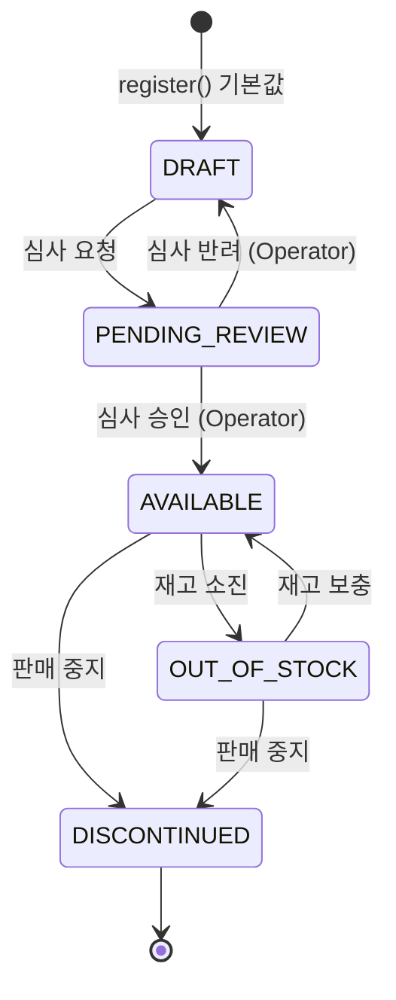

# Product Aggregate

> 등록 흐름 상세는 [../product/register-flow.md](../product/register-flow.md) 참조

## 개요

- **Bounded Context**: Catalog
- **Aggregate Root**: `Product` (`domain/.../product/Product.java`)
- **소유권**: Seller (CRUD, 본인 것만) / Operator (검수·상태전이) / Customer (R)
  - 상세 규칙은 [소유권 매트릭스](../../ownership-matrix.md) 참조

---

## Aggregate 구성

```
Product  (Aggregate Root)
├── ProductSku  1:N  (cascade=ALL, orphanRemoval=true)
└── ProductImage  1:N  (cascade=ALL, orphanRemoval=true)
```

**외부 참조** (다른 Aggregate — 직접 참조, 같은 트랜잭션 안에서만):

| 참조 대상 | 관계 | 용도 |
|---|---|---|
| `Member` (seller) | N:1 | 상품 등록자 (SELLER 역할 검증) |
| `Category` | N:1 | 카테고리 분류 |
| `ProductAttributeSchema` | 검증 시 조회만 | 속성 값 규칙 검증 — Aggregate 멤버가 아님 |

---

## 필드

### Product (Root)

| 필드 | 타입 | 설명 |
|---|---|---|
| `productId` | `Long` | PK, auto increment |
| `seller` | `Member` (LAZY) | 등록 판매자 |
| `category` | `Category` (LAZY) | 카테고리 |
| `productName` | `String` | 상품명 (필수) |
| `descriptionHtml` | `String` | 상세 설명 HTML |
| `productStatus` | `ProductStatus` | 상태 (기본 `DRAFT`) |
| `brand` | `String` | 브랜드 (필수) |
| `manufacturer` | `String` | 제조사 (필수) |
| `salesStartDate` | `LocalDateTime` | 판매 시작일 (기본 now()) |
| `salesEndDate` | `LocalDateTime` | 판매 종료일 (optional) |
| `attributes` | `Map<String,Object>` | 카테고리별 동적 속성 (MySQL JSON 컬럼) |
| `skus` | `List<ProductSku>` | SKU 목록 (최소 1개) |
| `images` | `List<ProductImage>` | 이미지 목록 |

### ProductSku (멤버)

| 필드 | 타입 | 설명 |
|---|---|---|
| `skuId` | `Long` | PK |
| `product` | `Product` (LAZY) | 소속 Product |
| `skuCode` | `String` | SKU 코드 (product 내 unique) |
| `options` | `Map<String,Object>` | 옵션 (예: `{"color":"RED","size":"L"}`) |
| `price` | `Integer` | 가격 (≥ 0) |
| `stockQuantity` | `Integer` | 재고 (≥ 0) |
| `active` | `boolean` | 활성 여부 |

### ProductImage (멤버)

| 필드 | 타입 | 설명 |
|---|---|---|
| `imageId` | `Long` | PK |
| `product` | `Product` (LAZY) | 소속 Product |
| `imageType` | `ProductImageType` | `THUMBNAIL` / `DETAIL` / `OPTION` |
| `imagePath` | `String` | 이미지 경로 |
| `displayOrder` | `Integer` | 표시 순서 |

---

## 불변식

| 불변식 | 강제 위치 |
|---|---|
| SKU 최소 1개 | `Product.validateSku()` (private static) |
| `seller` 는 `MemberRole.SELLER` 여야 함 | `Product.validateSeller()` (private static) |
| `salesEndDate` > `salesStartDate` (종료일 있을 때만) | `Product.validateSalesDate()` (private static) |
| SKU `price` ≥ 0, `stockQuantity` ≥ 0 | `ProductSku.create()` 내 검증 |
| 멤버(Sku/Image) 생성은 Root 를 통해서만 | `ProductSku.create()` / `ProductImage.create()` 가 package-private |

---

## 상태 머신 (ProductStatus)



| 상태 | 한글 | 허용 다음 상태 |
|---|---|---|
| `DRAFT` | 작성중 | `PENDING_REVIEW` |
| `PENDING_REVIEW` | 심사대기 | `AVAILABLE`, `DRAFT` |
| `AVAILABLE` | 판매중 | `OUT_OF_STOCK`, `DISCONTINUED` |
| `OUT_OF_STOCK` | 품절 | `AVAILABLE`, `DISCONTINUED` |
| `DISCONTINUED` | 판매종료 | ∅ (종단 상태) |

전이 시 허용되지 않는 조합이면 `IllegalStateException` 발생 (`Product.changeProductStatus`).

---

## 핵심 메서드

### Product

| 메서드 | 설명 |
|---|---|
| `register(payload, seller, category)` | 정적 팩토리. payload 의 skus/images 를 순회하며 멤버 생성 |
| `registerSku(skuCode, options, price, stockQuantity)` | SKU 추가. `ProductSku.create()` 호출 후 `skus` 에 추가 |
| `removeSku(sku)` | SKU 제거 (`orphanRemoval` 로 DB 반영) |
| `addImage(type, path, order)` | 이미지 추가. `ProductImage.create()` 호출 |
| `removeImage(image)` | 이미지 제거 |
| `changeProductName(name)` | 상품명 변경 |
| `changeProductStatus(status)` | 상태 전이. 허용되지 않는 전이면 예외 |
| `changeDescriptionHtml(html)` | 상세 설명 변경 |
| `changeAttributes(attributes, schema)` | 동적 속성 변경. `schema` 가 있으면 검증 선행 |
| `changeSalesStartDate(date)` | 판매 시작일 변경 (날짜 정합성 검증) |
| `changeSalesEndDate(date)` | 판매 종료일 변경 |

### ProductSku

| 메서드 | 설명 |
|---|---|
| `changePrice(price)` | 가격 변경 (≥ 0 검증) |
| `decreaseStock(qty)` | 재고 차감 (부족 시 예외) |
| `increaseStock(qty)` | 재고 증가 |
| `activate()` / `deactivate()` | SKU 활성/비활성화 |

### ProductImage

| 메서드 | 설명 |
|---|---|
| `changeOrder(order)` | 표시 순서 변경 |

---

## 영속화 전략

- `Product` / `ProductSku` / `ProductImage` 는 `@Entity`.
- `cascade=ALL`, `orphanRemoval=true` — `Product` 를 통해서만 CRUD 발생.
- `Product.attributes`, `ProductSku.options` → `JsonAttributeConverter` (Jackson) 로 MySQL `json` 컬럼에 직렬화.
- Out 포트: `ProductRepository extends Repository<Product, Long>` (Spring Data 직접 상속, 별도 JPA 어댑터 없음).
